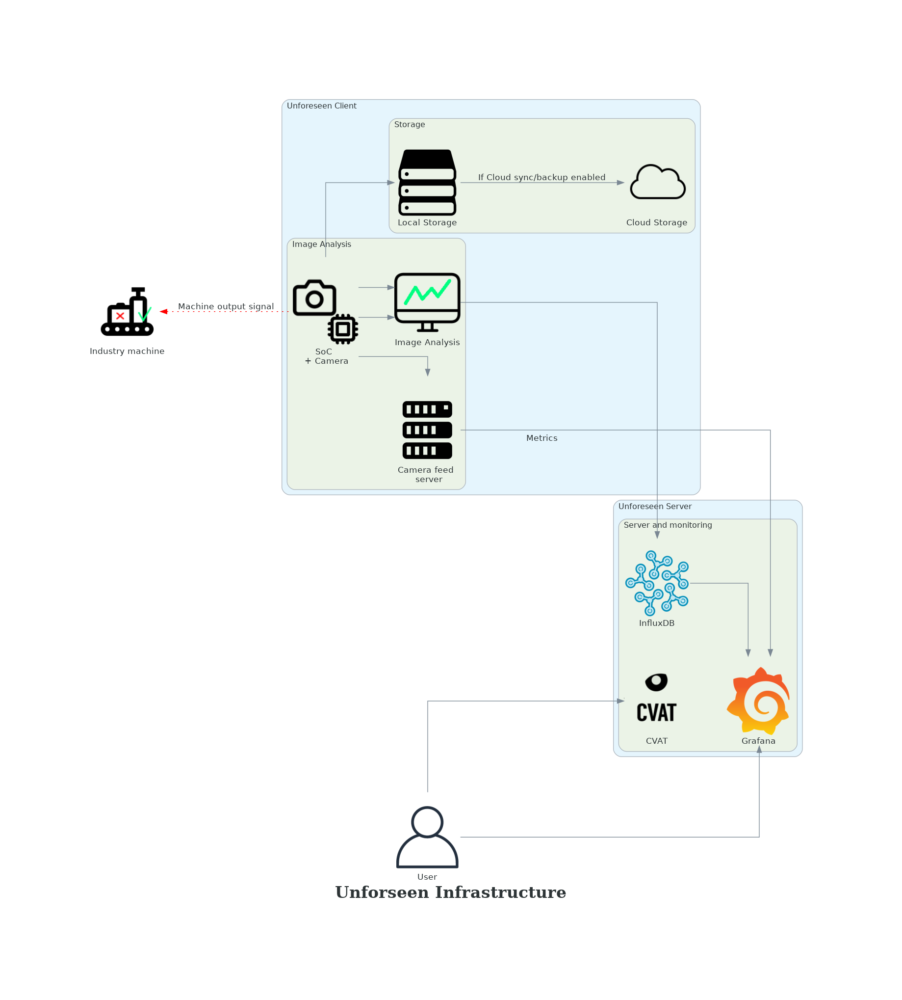

# Unforeseen
Unforeseen is an open source client–server model for computer vision applications.
Unforeseen is meant to be robust and able to run on low cost SoC devices (Raspberry Pi / Jetson Nano), which makes it ideal for easy deployment in a production facility / manufacturing factory, or just for your vision DIY projects.

All communication between the client and server is done via HTTP (except for remote camera calibration). This of course leaves some restrictions w.r.t e.g RTSP, however the HTTP protocol is chosen to make integration with prometheus and grafana seamless and to give the end user (whom might not be a computer expert) an easy way to access the data dashboard. See the diagram for a complete overview.

### Unforeseen client
Currently the supported (maintained) SoC is the [Jetson Nano](https://developer.nvidia.com/embedded/jetson-nano-developer-kit), but the [Jetson Xavier](https://www.nvidia.com/en-us/autonomous-machines/embedded-systems/jetson-xavier-nx/) should work as well.
With slight modifications to the client code it should also be possible to get the [Coral](https://coral.ai/products/) to work.

See the [Client README.md](https://github.com/petoor/unforeseen-client/blob/main/README.md) to get started

### Unforeseen server
The server is assumed to be a Raspberry Pi 3+ or 4. However, any computer running linux should work just fine. 
Note in order to run the influxdb we need a 64-bit OS. See the [Raspberry Pi OS (64 bit)](https://downloads.raspberrypi.org/raspios_arm64/images/) as of writing, this is a beta version, but it seems to work just fine.

See the [Server README.md](https://github.com/petoor/unforeseen-server/blob/main/README.md) to get started
